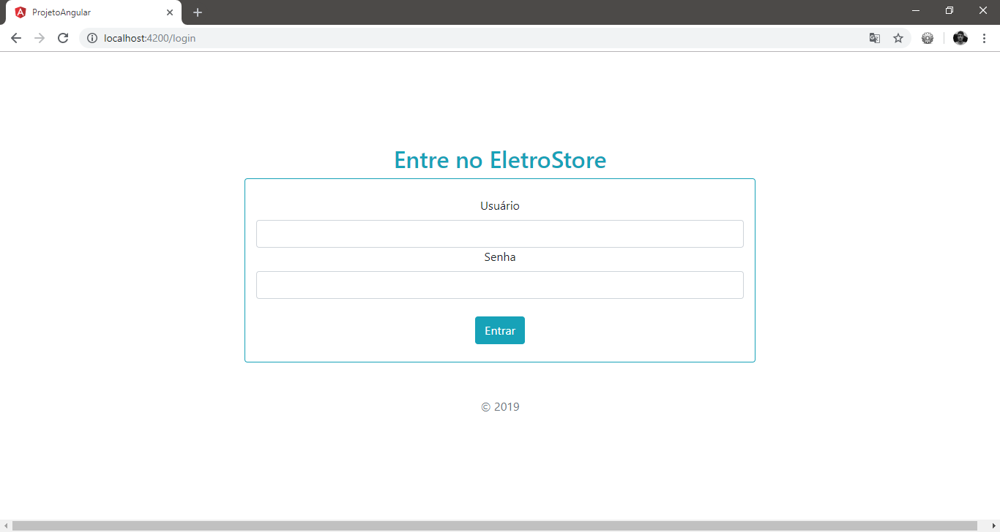
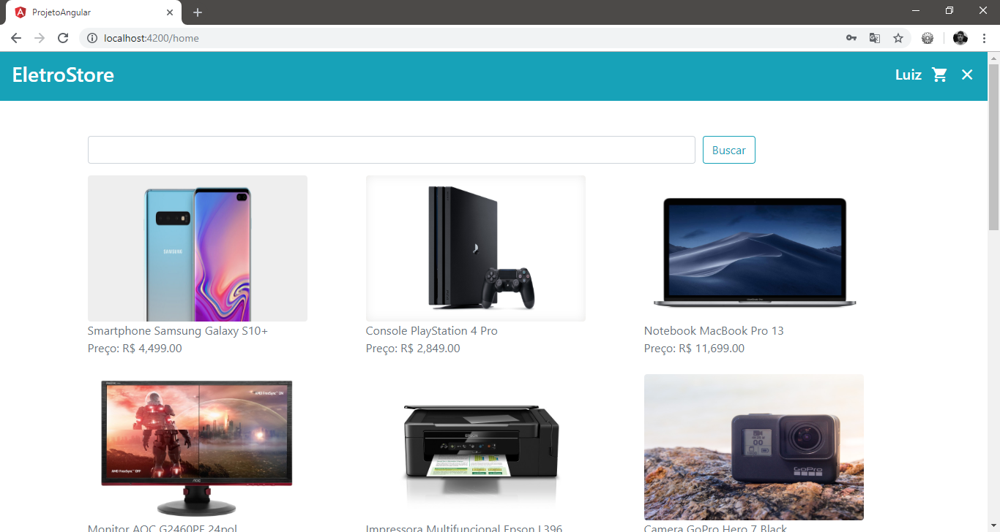
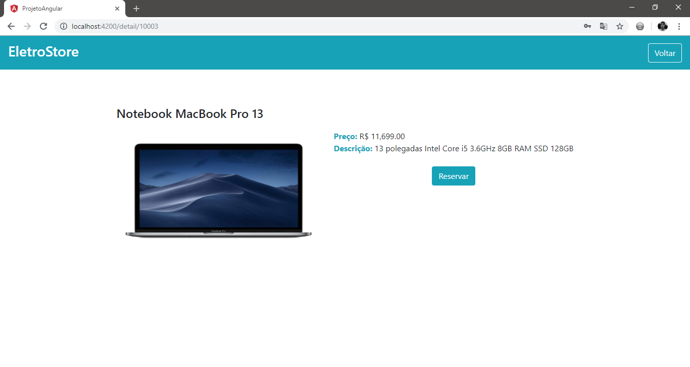
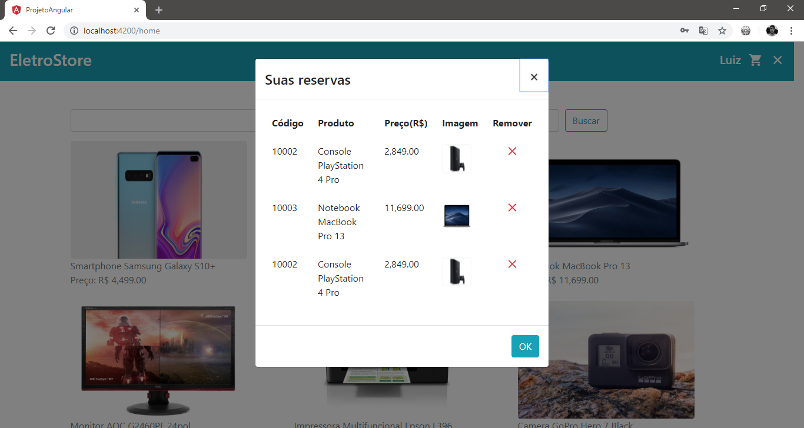

# Projeto Angular: Catálago eletrônico EletroStore

  Trabalho proposto pelo professor Maurício na disciplina de Programação para Dispositivos Móveis(7º Período) do curso de Ciência da Computação, cujo objetivo fora desenvolver uma aplicação Angular que utilize *services* e *routes*, além de um framework CSS. Neste caso foi utilizado o ngBootstrap.
  
  
#### ATENÇÃO: NÃO POSSUÍMOS NENHUM DIREITO AUTORAL SOBRE AS IMAGENS UTILIZADAS NESTE PROJETO; AS MESMAS FORAM UTILIZADAS COM O ÚNICO PROPÓSITO DE ESTUDO. ALÉM DISSO, AS ESPECIFICAÇÕES, DADOS E PREÇOS SOBRE OS PRODUTOS CITADOS NESTE PROJETO NÃO SÃO REAIS, SÃO APENAS DADOS ESTIMADOS, PORTANTO, NÃO DEVEM SER TOMADOS COMO LEGÍTIMOS.

###### Outros desenvolvedores: Willian Pereira Mariano

##### Capturas de tela:

#### Pacotes Utilizados:

**Angular:**

Angular CLI: 7.3.5

Node: 10.15.1

OS: win32 x64

Angular:
...

**Package --------------------- Version**

@angular-devkit/architect --- 0.13.5

@angular-devkit/core -------- 7.3.5

@angular-devkit/schematics - 7.3.5

@schematics/angular --------- 7.3.5

@schematics/update --------- 0.13.5

rxjs ----------------------------- 6.3.3

typescript ---------------------- 3.2.4
